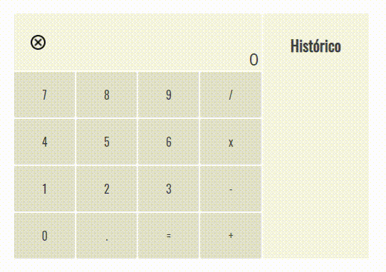

<h1 align="center">Calc-JS</h1>
<h2>Layout Web</h2>

<h2>Layout Mobile</h2>

<h2>Descrição</h2>

Calculadora basica, com layout responsivo. Funcionalidades desenvolvidas integralmente com Javascript.

<h2>Técnologias Utilizadas</h2>
<ul>
<li>HTML</li>
<li>CSS</li>
<li>Javacript</li>
<ul>

